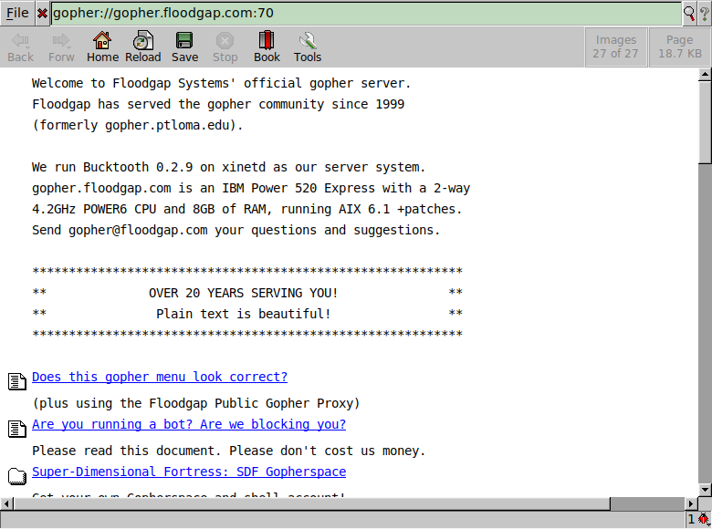

# Gopher plugin for Dillo

This plugin allows Dillo to open pages using the [Gopher
protocol](https://en.wikipedia.org/wiki/Gopher_(protocol)).



To install it use:

```sh
$ make install
```

Then open a gopher page using the `gopher:` protocol:

```sh
$ dillo gopher://gopher.floodgap.com:70
```

Created by [Charles E. Lehner](https://celehner.com/) along with other
[Dillo plugins](https://celehner.com/projects.html#dillo-plugins).
